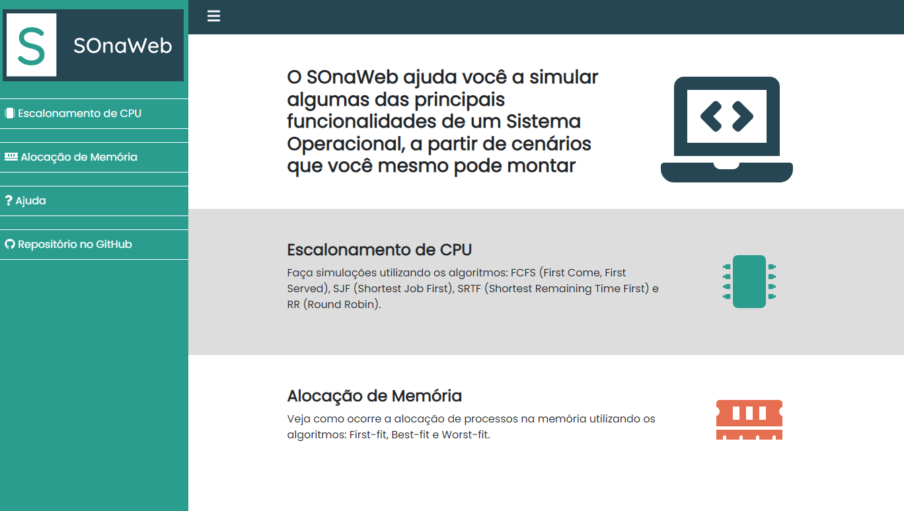

<h1 align="center">SOnaWeb</h1>

<h1 align="center">
  
</h1>

 

## 💻 Projeto

O SOnaWeb é um Simulador Web de um Sistema Operacional Para Fins Educacionais, que simula as funcionalidades de Escalonamento de CPU e Alocação de Memória.

 

## ✨ Tecnologias

Esse projeto foi desenvolvido com as seguintes tecnologias:

- [React](https://reactjs.org)
- [TypeScript](https://www.typescriptlang.org/)
- [Bootstrap](https://getbootstrap.com/)

 

## 🚀 Como executar

- Clone o repositório
- Instale as dependências com `npm install`
- Inicie a aplicação com `npm run dev`

A aplicação pode ser acessada em [`localhost:5173`](http://localhost:5173).

 

## 🔗 Acesso ao projeto

Você pode acessar o projeto clicando [aqui](https://sonaweb.vercel.app).

 

## 📄 Licença

Esse projeto está sob a licença MIT. Veja o arquivo [LICENSE](LICENSE) para mais detalhes.

---

Desenvolvido por Tiago Faria.
